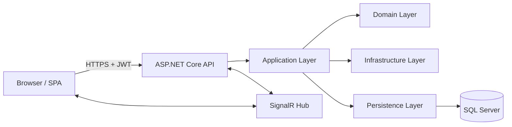

# HOA Community Events

A full-stack community platform for HOA residents and admins to manage events, attendance, and profiles.

This repository uses a Clean Architecture backend with a React SPA frontend.

## At a Glance

- Domain: HOA event management
- Primary users:
  - Residents: browse events, view details, join/leave attendance, manage profile
  - HOA Admins: create/edit/publish/unpublish/cancel/delete events, manage attendees and users
- Realtime: attendee updates via SignalR
- Security: ASP.NET Identity + JWT, role policies, lockout, rate limiting

## Tech Stack

### Backend

- ASP.NET Core Web API (net10.0)
- Clean Architecture layering:
  - API
  - Application
  - Domain
  - Infrastructure
  - Persistence
- EF Core + SQL Server
- ASP.NET Identity + JWT Bearer auth
- FluentValidation
- SignalR
- Swagger/OpenAPI (Development)

### Frontend

- React 19 + TypeScript + Vite
- React Router
- TanStack Query
- MobX
- Axios
- React Hook Form
- Tailwind CSS v4

## Solution Structure

```text
HoaCommunityEvents/
  API/              Web host, controllers, middleware, startup wiring
  Application/      Use-cases, DTOs, interfaces, options, validators
  Domain/           Entities and domain constants
  Infrastructure/   Cross-cutting services (token service, hubs)
  Persistence/      AppDbContext, migrations, seeding
  API.Tests/        Backend integration tests
  frontend/         React SPA
```

## Architecture Overview



## Layer Responsibilities

### API

- Hosts HTTP endpoints and middleware pipeline
- Applies authentication, authorization, CORS, and rate limiting
- Maps requests/responses and returns standardized API error envelopes

### Application

- Contains orchestration and use-case logic
- Defines DTOs and service interfaces
- Holds validation rules and application options

### Domain

- Contains core business entities and role constants
- No framework-specific infrastructure concerns

### Infrastructure

- Implements cross-cutting services (for example, token generation)
- Contains real-time hub integration support

### Persistence

- Owns EF Core DbContext and migrations
- Handles database access and startup seed operations

## Core Functional Areas

### Authentication and Authorization

- Register, login, and current-user flows
- JWT validation includes issuer and audience
- Lockout policy enabled for repeated failed login attempts
- Role-based policies:
  - Admin-only
  - Resident-or-admin

### Events

- Public read endpoints for listing and details
- Admin mutation endpoints:
  - create
  - edit
  - publish / unpublish
  - cancel
  - delete
- Paged list contract: items, totalCount, page, pageSize, totalPages

### Attendance

- Join/leave attendance workflows
- Realtime attendee count updates through SignalR

### Profiles

- Profile read and update flows
- Ownership and access checks

### File Uploads

- Cloudinary-backed upload support
- Upload signature endpoint rate-limited

## Security Model

- JWT Bearer authentication for protected endpoints
- Identity lockout enabled:
  - Max failed attempts: 5
  - Default lockout: 15 minutes
- Rate limiting:
  - Global limiter for all requests
  - Tight limiter for auth login/register endpoints
  - Upload-signature specific policy
- Startup safety validation blocks unsafe production config

## API Runtime Pipeline

Current runtime sequence (from startup wiring):

1. Exception middleware
2. HTTPS redirection
3. CORS policy (Frontend)
4. Rate limiter
5. Authentication
6. Authorization
7. Controllers + SignalR hub mapping

Health endpoint: /health

## Frontend Architecture Summary

- App shell and routing in app-level modules
- Feature-first pages under frontend/src/features
- API calls centralized in app/api/agent.ts
- Server-state caching and mutations via TanStack Query hooks
- Route protection via ProtectedRoute

Important routing behavior:

- /events is the event feed page
- Admin management is centralized under /admin/events
- /events/create and /events/:id/edit currently redirect rather than serving standalone forms

## Configuration and Environment

### Required Backend Settings

- ConnectionStrings:DefaultConnection
- TokenKey
- Jwt options (issuer/audience)
- Cloudinary settings (if uploads enabled)
- Cors:AllowedOrigins
- Seed toggles:
  - Seed:EnableBootstrap
  - Seed:EnableDemoData

### Seed Safety Rules

- Production must not run with demo data enabled
- Startup validation fails fast if production safety constraints are violated

## Local Development

### 1) Backend setup

```bash
cd HoaCommunityEvents/API
dotnet user-secrets init
dotnet user-secrets set "TokenKey" "replace-with-long-random-dev-key-at-least-64-characters"
```

Set a development SQL Server connection in appsettings.Development.json.

### 2) Apply migrations

```bash
cd ..
dotnet ef database update -p Persistence -s API
```

### 3) Frontend setup

```bash
cd frontend
npm install
```

Create frontend/.env (or .env.local):

```text
VITE_API_URL=http://localhost:5284/api
```

### 4) Run the app

Backend (solution root):

```bash
dotnet run --project API
```

Frontend:

```bash
cd frontend
npm run dev
```

### 5) Verify

- API health: http://localhost:5284/health
- Swagger (Development): http://localhost:5284/swagger

## Testing and Quality Checks

From solution root:

```bash
dotnet build HoaCommunityEvents.slnx
dotnet test API.Tests
```

From frontend:

```bash
npm run lint
npm run test
npm run build
```

E2E tests (workspace root):

```bash
npx playwright test
```

## Deployment Overview

### API

- Target: Azure App Service
- Deployment workflow: .github/workflows/deploy-api-azure.yml
- Optional EF migration step runs when SQL connection secret is configured

### Frontend

- Target: Azure Static Web Apps
- Workflow: .github/workflows/azure-static-web-apps-blue-moss-0d503960f.yml
- Build settings:
  - app location: HoaCommunityEvents/frontend
  - output location: dist
- SPA fallback config: frontend/public/staticwebapp.config.json

### CI

- Workflow: .github/workflows/ci.yml
- Includes backend build/tests and frontend lint/build validation

## Troubleshooting Quick Hits

- Login/register CORS failures:
  - Verify frontend origin is present in API CORS config and restart API
- SPA deep-link 404:
  - Confirm staticwebapp.config.json is included in frontend deployment artifact
- TokenKey startup failure:
  - Ensure TokenKey is configured for the environment
- Frontend calls wrong host:
  - Verify VITE_API_URL and redeploy frontend

## Naming Conventions

- Backend projects and namespaces follow HoaCommunityEvents.\*
- Frontend folder remains lowercase frontend to align with Node ecosystem conventions

## Current Product Direction

The app is structured to keep resident-facing browsing simple while concentrating admin workflows in a dedicated dashboard. This keeps core user flows clear and supports incremental feature growth without collapsing boundaries between UI, API, and data concerns.
