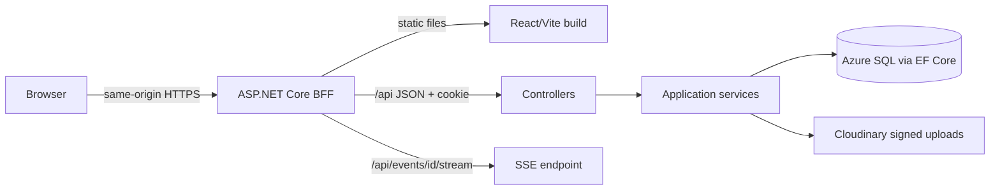
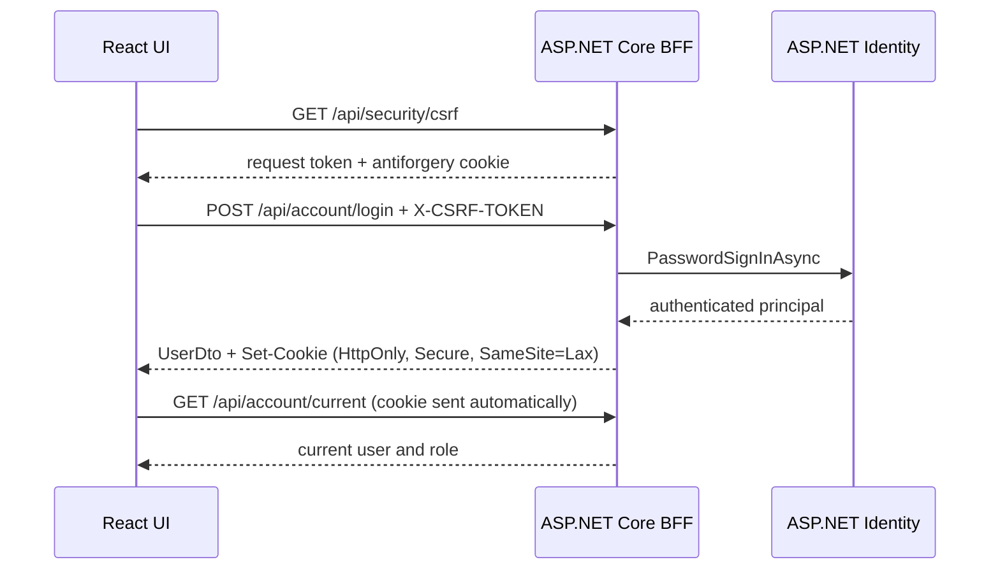
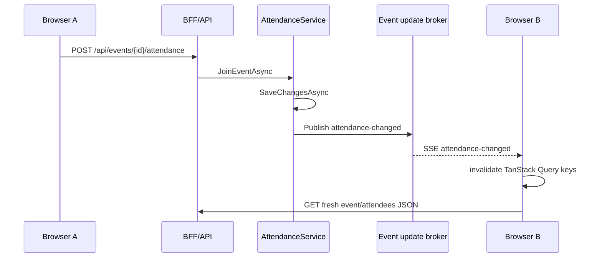

# HOA Community Events BFF, SSE, and Clean Structure Design

## Purpose

Reshape the repository and runtime so the code is easier to learn, safer in the browser, and simpler to deploy. The React application remains a distinct source project, but production becomes one web application: ASP.NET Core serves the built SPA, exposes the API, owns the authentication session, and streams event attendance changes.

## Goals

- Put all browser code under `frontend/` and all .NET code under `backend/`.
- Preserve Clean Architecture project boundaries while making the physical layout obvious.
- Replace JavaScript-readable JWT storage with an encrypted, `HttpOnly` Identity cookie.
- Protect cookie-authenticated write requests against CSRF.
- Replace SignalR with native Server-Sent Events (SSE) for one-way attendance invalidation.
- Replace ambiguous Enabled/Disabled buttons with an accessible switch for true binary settings.
- Update tests, deployment automation, repository documentation, the generated code graph, and the published learning site.

## Non-goals

- No change to event, attendance, profile, role, or Cloudinary business rules.
- No rewrite of React, TanStack Query, MobX, EF Core, or the existing controller/service pattern.
- No WebSocket-style client-to-server live commands; ordinary HTTP mutations remain the write path.
- No distributed message broker in the first release. The first SSE broker targets one API instance and exposes interfaces that can later be backed by Azure Web PubSub or Redis.
- No Identity database/schema rewrite. `AppUser` remains the existing Identity-backed entity; changing that model would add migration risk without helping the requested browser flow.
- Publish/unpublish/cancel/delete remain explicit workflow actions. They are not settings switches.

## Repository Structure

```text
HoaCommunityEvents/
  frontend/                         React, TypeScript, Vite, Vitest, Playwright
    tests/e2e/                      browser workflow and accessibility tests
    playwright.config.ts
  backend/
    HoaCommunityEvents.slnx
    src/
      API/                          ASP.NET Core presentation host and BFF
      Application/                  contracts, DTOs, validation, use-case boundaries
      Domain/                       entities and domain constants
      Infrastructure/               external and runtime implementations
      Persistence/                  EF Core context, migrations, seed data
    tests/
      API.Tests/                    integration tests through WebApplicationFactory
  docs/                             diagrams, designs, implementation plans
  graphify-out/                     generated code graph
  README.md
```

`frontend/` and `backend/` are the two product halves. Root-level `docs/`, generated analysis, repository configuration, and README files remain at the root because they describe both halves. Project and namespace names stay unchanged to avoid a cosmetic rename with no architectural value.

The existing monorepo-root Playwright tests/configuration and E2E-only npm package are consolidated into `frontend/`; there is no longer a separate root frontend-test package.

As part of the move, the Identity-dependent `AccountService` and `ProfileService` implementations move from Application to Infrastructure while their interfaces and DTOs stay in Application. This restores the inward dependency direction without redesigning the existing Identity database model.

## Production Runtime Boundary

The .NET API project becomes the Browser-Facing Frontend (BFF) host:



Vite still provides the local development server, but it proxies `/api` to ASP.NET Core. This makes local browser requests same-origin from the SPA's perspective and avoids a second authentication design for development. During `dotnet publish`, the frontend is built and copied into the API publish output as `wwwroot`. ASP.NET Core serves those files and falls back to `index.html` for React routes.

## Cookie Authentication and CSRF

ASP.NET Core Identity remains responsible for users, password hashing, lockout, claims, and roles. Only the browser session transport changes.

### Login sequence



The React app never reads the authentication cookie. It only asks `/api/account/current` who is signed in. Axios uses relative `/api` URLs and `withCredentials: true`; the JWT request interceptor and all `localStorage.jwt` code are removed.

Unsafe requests (`POST`, `PUT`, `PATCH`, `DELETE`) require ASP.NET Core antiforgery validation. The SPA obtains a request token from a safe bootstrap endpoint and sends it in `X-CSRF-TOKEN`. The encrypted antiforgery cookie is `HttpOnly`; the request token lives only in module memory and is refreshed after login, registration, or logout because the authenticated identity changed.

The authentication cookie uses an application-specific name, `HttpOnly`, `SameSite=Lax`, a finite lifetime, and `Secure=Always` outside Development. .NET 10 API endpoints return 401/403 instead of HTML redirects, so the existing JSON-oriented frontend error handling remains appropriate.

## Server-Sent Events

Attendance changes are server-to-browser notifications. The browser already sends join/leave through normal HTTP and only needs a signal that cached event data is stale. SSE therefore matches the required direction with less protocol and client code than SignalR.



Application defines publisher and subscriber interfaces plus a small event-update contract. Infrastructure implements a singleton in-memory broadcast broker using one bounded channel per subscriber, not one shared consumer channel. A slow or disconnected browser cannot block an attendance write; old notifications may be dropped because each notification means “refetch current truth,” not “apply this as an irreplaceable transaction.”

The API exposes `GET /api/events/{eventId}/stream`, authorized for residents and admins, and uses the .NET 10 typed SSE response. The frontend's `useEventStream` hook creates a native `EventSource`. On `attendance-changed`, it invalidates `['event', eventId]`, `['events']`, and `['attendees', eventId]`. EventSource reconnect behavior handles ordinary network interruptions.

The first broker is process-local. Production must initially run one API instance. If horizontal scale becomes necessary, the interfaces remain stable while Infrastructure changes to Azure Web PubSub, Redis pub/sub, or another shared broker.

## Axios and TanStack Query Are Different Layers

The request path is:

```text
React page -> TanStack Query hook -> Axios API agent -> HTTP API
```

Axios is the transport client in `frontend/src/app/api/agent.ts`. It knows the API base URL, sends HTTP methods and bodies, includes browser credentials, attaches the antiforgery header, parses JSON, and normalizes HTTP failures.

TanStack Query is the server-state coordinator in `frontend/src/hooks/useEvents.ts`, `useAttendance.ts`, `useProfile.ts`, and `useAdminUsers.ts`. It decides when a request runs, tracks loading/error/success state, caches results under query keys, deduplicates consumers, drives mutations, and invalidates/refetches cached data after writes or SSE notifications. TanStack Query does not choose or require an HTTP client; its query function calls Axios here.

Decision: keep both. Replacing Axios with native `fetch` is technically possible, but this codebase would immediately need a replacement wrapper for credentials, CSRF, JSON, and standardized errors. Removing TanStack Query would require substantially more custom cache and lifecycle code. Because both libraries are already installed and their boundary is clear, deleting either during the security/SSE migration would create churn without reducing the application's conceptual responsibilities.

## Switch Interaction Pattern

Add one reusable design-system `Switch` with `role="switch"`, `aria-checked`, keyboard activation, a visible label, optional description, focus styling, and disabled styling. Use it for:

- Use profile avatar
- Use profile banner
- Use event banner

Turning a switch off preserves the existing submit contract: the form sends no image URL or crop values, so the saved entity no longer displays that image. The UI clearly labels the consequence. Publish/unpublish, cancellation, deletion, theme selection, tab selection, and navigation expansion keep their existing interaction types because they are not equivalent binary settings.

## Release and Deployment

The combined App Service workflow installs Node and .NET, runs frontend tests/build, publishes the .NET BFF with the SPA assets, optionally applies EF migrations, and deploys one artifact. The old Static Web Apps workflow remains active until the combined deployment passes a production smoke test; it is then disabled or removed to prevent two independently deployed frontends from drifting.

No database migration is required for cookie auth, SSE, or the switch styling because image enablement continues to be represented by the presence or absence of the image URL.

## Verification

- Backend integration tests prove antiforgery rejection, cookie creation, current-user restoration, logout invalidation, role enforcement, and SSE authorization/notification.
- Frontend tests prove no JWT/localStorage dependency, asynchronous logout, CSRF header attachment, EventSource cleanup/invalidation, and switch semantics.
- Full checks: `dotnet test`, frontend lint/test/build, `dotnet publish`, local BFF smoke test, and browser checks for login, refresh, logout, event join/leave, and all three switches.
- The README, architecture diagram, code graph, and learning site must show the new paths and runtime flows and must remove JWT/SignalR claims.

## Accepted Tradeoffs

- One deployable application is simpler and safer for browser cookies, but frontend and backend can no longer be released independently.
- SSE is ideal for the current one-way invalidation use case, but it is not a replacement for bidirectional live collaboration.
- The in-memory broker is intentionally small and testable, but it constrains the first deployment to one API instance until a shared broker is introduced.
- Axios remains a small transport layer and TanStack Query remains the server-state layer; consolidate only if future measurements show that maintaining both has a real cost.

## Reference Basis

- [Microsoft: Cookie authentication in ASP.NET Core 10](https://learn.microsoft.com/en-us/aspnet/core/security/authentication/cookie?view=aspnetcore-10.0)
- [Microsoft: .NET 10 API endpoint behavior with cookies](https://learn.microsoft.com/en-us/aspnet/core/security/authentication/api-endpoint-auth?view=aspnetcore-10.0)
- [Microsoft: Prevent CSRF attacks in ASP.NET Core](https://learn.microsoft.com/en-us/aspnet/core/security/anti-request-forgery?view=aspnetcore-10.0)
- [Microsoft: TypedResults.ServerSentEvents in ASP.NET Core 10](https://learn.microsoft.com/en-us/dotnet/api/microsoft.aspnetcore.http.typedresults.serversentevents?view=aspnetcore-10.0)
- [MDN: EventSource credentials behavior](https://developer.mozilla.org/en-US/docs/Web/API/EventSource/withCredentials)
